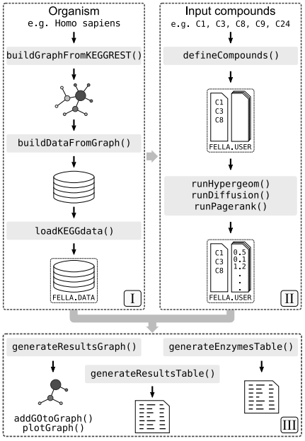

```{r setup, include=FALSE}
knitr::opts_chunk$set(echo = TRUE)
```

________________________________________________________________________________

Try to understand the analysis steps that are respectively contained in the code 
chunks. Add comments and explanations about the purpose and meaning of the 
subsequent steps above every code chunk. Comment and interpret the results below 
the respective code chunk. Repeat this for every step/chunk until the whole 
analysis is done. Summarize and interpret the findings to finish off this task.

________________________________________________________________________________


### *1 Introduction*

The underlying study to be analyzed is a comparative experiment to investigate 
the response of mice to a stimuli. The samples were collected from wild type 
mice and mice with a knocked out NOS2 gene, that were either mock treated 
(placebo), or given streptomycin (an antibiotic). To be more precise, the fecal 
metabolome of nitric oxide synthase 2 (NOS2)-deficient C57BL/6J mice 3 days 
after mock treatment (sterile water) or oral gavage with a single dose of 
streptomycin (20 mg/animal) was assessed by measuring the metabolite response 
after these stimuli. 29 samples were evaluated for 668 different metabolites. 
Starting point of a this metabolomic analysis in R is a file containing the 
concentration measurement signals of 668 already identified metabolites for all 
29 subjects belonging to the different trial groups. 

Such a study with a statistical and computational approach can answer questions 
that would be too comprehensive and complex for a manual analysis. With an 
increasing amount of (meta-)data generated by research studies more insights in 
systems biology are possible, but the approaches have to be able to adapt to 
this development too. An omics analysis pipeline like the present one, applies a 
series of algorithms that process raw data and generate interpretations from 
this data.

The packages `omu` and `FELLA` are applied to filter the data for meaningful 
information as well as to perform statistical tests and add context to the "raw" 
metabolite response signals. To achieve this, an online connection to the
databases of the Kyoto Encyclopedia Of Genes (KEGG) platform is established to
annotate metabolites with interconnecting relationships within complex 
biological systems. Plotting of this data convertes big datasets in a 
human-readable format to enable interpretations and make correlations obvious.

1. In the following code chunk, change the path in the argument `dir` of the 
function `setwd()` with the previously created local folder `Metabolomics` that 
contains all (unzipped) data for this assignment. Note that R only reads forward 
slashes (/) and no backwards slashes (\) as used in Windows Explorer. Run the 
code.

```{r}
setwd(dir = "D:/OneDrive/Projekte/Programming/R/Projekte/metabolomics") # <- change here
```

2. Run the chunk to see an outline of the workflow of the FELLA package. Before 
the compounds are input (block II), the "raw" data is processed and filtered by 
functions of the omu package.

```{r message=FALSE, fig.width=10, fig.height=10}
 # Fig 1 from Picart-Armada (2018)
```

#### *1.1 Loading Packages*

```{r message = FALSE}
if (!require(BiocManager)) install.packages('BiocManager')
library(BiocManager)

if (!require(FELLA)) install('FELLA')
library(FELLA)

if (!require(org.Mm.eg.db)) install('org.Mm.eg.db')
library(org.Mm.eg.db)

if (!require(KEGGREST)) install('KEGGREST')
library(KEGGREST)

if (!require(igraph)) install.packages('igraph')
library(igraph)

if (!require(magrittr)) install.packages('magrittr')
library(magrittr)

if (!require(dplyr)) install.packages('dplyr')
library(dplyr)

if (!require(shiny)) install.packages('shiny')
library(shiny)

if (!require(knitr)) install.packages('knitr')
library(knitr)

if (!require(visNetwork)) install.packages('visNetwork')
library(visNetwork)

if (!require(DT)) install.packages('DT')
library(DT)

if (!require(biomaRt)) install('biomaRt')
library(biomaRt)

if (!require(omu)) install.packages('omu')
library(omu)

if (!require(ggplot2)) install.packages('ggplot2')
library(ggplot2)
```


### *2 Processing of Metabolite Data*

#### *2.1 Importing Data*

Importing the metabolomics dataset containing metabolite concentration values of
each subject in the trial and the respectively annotated metabolite. 

```{r}
metabolite_count <- read.csv("metabolite_count.csv") 
dim(metabolite_count) # dimensions
metabolite_count
```

The dataset encompasses 668 metabolites that were measured among all 29 
subjects.
________________________________________________________________________________

Another dataset containing information on each subject gets imported. 

```{r}
metabolite_metadata <- read.csv("metabolite_metadata.csv") 
str(metabolite_metadata) # structure
metabolite_metadata
```

The 29 samples are grouped by their characteristics. The genetic background is 
either WT (wild-type) or Nos2 (Nos2-Knockout), the treatment either Mock (mock 
treated or Strep (streptomycin treated). Grouping the samples by combining these 
two discrete variables results into four different groups (WTMock, WTStrep, 
Nos2Mock, Nos2Strep).

#### *2.2 Assigning Hierarchical Class Data*

Using the KEGG ontology system, each metabolite gets allocated to a class 
hierarchy system, i.e. a main class as well as up to four sub-classes. 

```{r}
metabolite_info <- assign_hierarchy(count_data = metabolite_count, 
                                    keep_unknowns = TRUE, identifier = "KEGG")

metabolite_info
```

Information on the respective metabolite classification is appended to the 
metabolite_count data frame with 5 additional columns. 
________________________________________________________________________________

Heatmap of data sorted by metabolite subclass (before processing).

```{r}
heatmap_subclass_pre <- plot_heatmap(count_data = metabolite_info, 
                                     metadata = metabolite_metadata, 
                                     Factor = "Treatment", 
                                     response_variable = "Metabolite", 
                                     log_transform = TRUE, 
                                     high_color = "goldenrod2", 
                                     low_color = "midnightblue", 
                                     aggregate_by = "Subclass_1") + 
                                theme(axis.text.x = element_text(angle = 30, 
                                                                 hjust=1, 
                                                                 vjust=1, 
                                                                 size = 6), 
                                      axis.text.y = element_text(size = 6)) +
                                labs(y = "Metabolite Subclass")

heatmap_subclass_pre
```

________________________________________________________________________________

Boxplot of metabolite abundance grouped by class and treatment (unprocessed).

```{r}
boxplot_subclass_pre <- plot_boxplot(count_data = metabolite_info, 
                                 metadata = metabolite_metadata, 
                                 log_transform = TRUE, Factor = "Treatment", 
                                 response_variable = "Metabolite", 
                                 fill_list = c("darkgoldenrod1", "dodgerblue2"), 
                                 aggregate_by = "Subclass_1") +
                            theme(axis.title.x = element_blank(),
                                  legend.title = element_blank())
boxplot_subclass_pre
```

#### *2.3 Multivariate Analysis*

A multivariate analysis with Principal Component Analysis (PCA) is performed
considering the different outcome groups. Before, the metabolite concentration 
are log-transformed.

```{r}
sample_data_log <- log(metabolite_count[,3:31])
sample_data_log <- cbind(metabolite_count[,1:2], sample_data_log)

PCA <- PCA_plot(count_data = sample_data_log, metadata = metabolite_metadata, 
                variable = "Grouped", color = "Grouped", 
                response_variable = "Metabolite") + theme_bw() + theme(panel.grid = element_blank())
PCA
```

#### *2.4 Univariate Analysis*

Significant differences in the metabolite profile between the treatment groups 
can be detected by applying an univariate statistical models, in this case the 
Welch t-test. Statistical information e.g. averaged log-fold change and standard 
deviation, gained by evaluating both treatment groups, is appended to the 
metabolite data frame. The resulting p values are adjusted with the Benjamini & 
Hochberg method.

```{r}
metabolite_stat_info <- omu_summary(count_data = metabolite_info, 
                                    metadata = metabolite_metadata, 
                                    numerator = "Strep", denominator = "Mock", 
                                    response_variable = "Metabolite", 
                                    Factor = "Treatment", log_transform = TRUE, 
                                    p_adjust = "BH", test_type = "welch")
metabolite_stat_info
```

________________________________________________________________________________

Visualizing the concentration net changes sorted by metabolite 
class.

```{r}
stats_counts <- count_fold_changes(count_data = metabolite_stat_info, 
                                   column = "Subclass_1", sig_threshold = 0.05,
                                   keep_unknowns = FALSE)
Class_Bar_Plot <- plot_bar(fc_data = stats_counts, 
                           fill = c("dodgerblue2", "firebrick2"), 
                           outline_color = c("black", "black"), size = c(1,1)) + 
                        labs(x = "Class") + 
                        theme(panel.grid = element_blank(), 
                              legend.title = element_blank())
Class_Bar_Plot
```

#### *2.5 Filtering*

In this step, data that do not contain information on biological effects are 
filtered out, while meaningful information is condensed and retained. To get an
overview, a volano plot is created.

```{r}
# Creating discrete color palette
c24 <- c("dodgerblue2", "#E31A1C", "green4","#6A3D9A", "#FF7F00", 
         "white","skyblue2", "#FB9A99", "palegreen2","#CAB2D6", 
         "#FDBF6F")

Volcano_Plot <- plot_volcano(count_data = metabolite_stat_info, size = 2, 
                             column = "Class", 
                             strpattern = as.character(unique(metabolite_stat_info$Class)), 
                             fill = c24[1:(1+length(as.character(unique(metabolite_stat_info$Class))))], 
                             color = rep("black", 1+length(as.character(unique(metabolite_stat_info$Class)))),
                             alpha = rep(0.7, 1+length(as.character(unique(metabolite_stat_info$Class)))), 
                             shape = rep(21, 1+length(as.character(unique(metabolite_stat_info$Class))))) +                                theme_bw() + 
                        theme(panel.grid = element_blank(), 
                              legend.title = element_blank())

Volcano_Plot
```

As displayed in the volcano plot, there are plenty metabolites with a 
p value below the significance threshold (p > 0.05). 
________________________________________________________________________________

Metabolites without a significant concentration difference between the groups 
are omitted. This step is counter-checked with a histogram. Also, metabolites 
which do not have a KEGG annotation because of their unavailability on KEGG they 
are filtered out. 

```{r}
sig_metabolites <- metabolite_stat_info %>% subset(!is.na(KEGG)) %>% subset(padj <= 0.05)

hist(sig_metabolites$padj, main = "Histogram of adjusted p-Values")
```


#### *2.6 Data Visualization*

Heatmap of metabolite subclasses after filtering, i.e. only displaying 
significant changes. 

```{r}
heatmap_subclass <- plot_heatmap(count_data = sig_metabolites, 
                                 metadata = metabolite_metadata, 
                                 Factor = "Treatment", 
                                 response_variable = "Metabolite", 
                                 log_transform = TRUE, 
                                 high_color = "goldenrod2", 
                                 low_color = "midnightblue", 
                                 aggregate_by = "Subclass_1") + 
                                theme(axis.text.x = element_text(angle = 30, 
                                                                 hjust=1, 
                                                                 vjust=1, 
                                                                 size = 6), 
                                      axis.text.y = element_text(size = 6)) +
                                labs(y = "Metabolite Subclass (p < 0.05)")

heatmap_subclass
```

________________________________________________________________________________

Heatmap with all distinct significantly imnvolved metabolites.

```{r}
heatmap_metabolites <- plot_heatmap(count_data = sig_metabolites, 
                              metadata = metabolite_metadata, 
                              Factor = "Treatment", 
                              response_variable = "Metabolite", 
                              log_transform = TRUE, high_color = "goldenrod2", 
                              low_color = "midnightblue") + 
                                theme(axis.text.x = element_text(angle = 30, 
                                                                 hjust=1, 
                                                                 vjust=1, 
                                                                 size = 6), 
                                      axis.text.y = element_text(size = 6)) +
                                labs(y = "Metabolite (p < 0.05")

heatmap_metabolites
```

________________________________________________________________________________

Boxplots displaying the metabolite abundance, grouped by class and treatment, 
are generated.

```{r}
boxplot_subclass <- plot_boxplot(count_data = sig_metabolites, 
                                 metadata = metabolite_metadata, 
                                 log_transform = TRUE, Factor = "Treatment", 
                                 response_variable = "Metabolite", 
                                 fill_list = c("darkgoldenrod1", "dodgerblue2"), 
                                 aggregate_by = "Subclass_1") +
                            theme(axis.title.x = element_blank(),
                                  legend.title = element_blank())
boxplot_subclass
```

________________________________________________________________________________

Boxplots showing the first 12 significant metabolites, grouped by treatment, 
are displayed.

```{r}
boxplot_metabolites <- plot_boxplot(count_data = sig_metabolites[1:12,], 
                                 metadata = metabolite_metadata, 
                                 log_transform = TRUE, Factor = "Treatment", 
                                 response_variable = "Metabolite", 
                                 fill_list = c("darkgoldenrod1", "dodgerblue2"), 
                                 aggregate_by = "Metabolite") +
                            theme(axis.title.x = element_blank(),
                                  legend.title = element_blank())
boxplot_metabolites
```


### *3 Enrichment*

#### *3.1 Building the database*

*FELLA Workflow - Organism Step I*

By accessing the Kyoto Encyclopedia Of Genes (KEGG), up-to-date information can
be retrieved from this online database. Only information connected to the 
species Mus musculus (mice) is filtered and saved as a local database. In this 
way we save computational power and bandwidth needed for the communication with 
the KEGG servers. The KEGG platform, which serves as an ontology for biological 
systems on multiple levels, provides information in which reactions metabolites 
are involved, within which metabolic network this takes place, as well as which 
enzymes and hence genes they are connected to (and many more e.g. pathways, 
diseases etc.). This step may take a few minutes to complete - avoid to 
interrupt this process. 

```{r message=FALSE}
set.seed(1)

# Filter overview pathways
graph <- buildGraphFromKEGGREST(
  organism = "mmu", 
  filter.path = c("01100", "01200", "01210", "01212", "01230"))

tmpdir <- paste0(tempdir(), "/my_database")

unlink(tmpdir, recursive = TRUE)  

buildDataFromGraph(keggdata.graph = graph, databaseDir = tmpdir, 
                   internalDir = FALSE, matrices = "none", 
                   normality = "diffusion", niter = 100)
```

________________________________________________________________________________

We build and load the FELLA.DATA object and two mappings (from gene symbol to
entrez identifiers, and from enzyme identifiers of the EC system (Enzyme 
Commission Number) to their annotated entrez genes.

```{r }
alias2entrez <- as.list(org.Mm.eg.db::org.Mm.egSYMBOL2EG)
entrez2ec <- KEGGREST::keggLink("enzyme", "mmu")
entrez2path <- KEGGREST::keggLink("pathway", "mmu")

fella.data <- loadKEGGdata(
  databaseDir = tmpdir, 
  internalDir = FALSE, 
  loadMatrix = "none"
)

# Summary of the database
fella.data
cat(getInfo(fella.data))
```


#### *3.2 Defining the input and running the enrichment*

*FELLA Workflow - Input Compounds II*

A list of significantly affected metabolites from the primary analyis with omu 
is inserted in the enrich function. With the heat diffusion model a sub-network 
analysis is performed on the KEGG graph to extract a meaningful subgraph. 

```{r message=FALSE}
enriched_metabolites <- enrich(compounds = sig_metabolites$KEGG, 
                               data = fella.data, 
                               method = "diffusion", 
                               approx = "normality")

enriched_metabolites
```

________________________________________________________________________________

Compounds that were not able to be successfully mapped are detected with 
getExcluded().

```{r}
getExcluded(enriched_metabolites)
```


#### *3.3 Page Rank Analysis*

The resulting subgraph shows the relevant parts of the KEGG graph (limited to 
210 nodes) and reveals involved modules, enzymes and reactions that link 
affected pathways and compounds. Try to change the `nlimit` argument in the
and observe the effect.

```{r fig.width = 10, fig.height = 10}
plot(enriched_metabolites, 
     method = "diffusion", 
     data = fella.data, 
     nlimit = 210,  
     plotLegend = TRUE)
```

FELLA offers a graphical user interface that wraps the functionality of the R
package. This tool enables interactive control of the result graph and lets the 
user zoom, move, search and highlight nodes. Unfortunately, at the time of 
writing this script, the upload doesn't seem to work properly. You can start the 
app by running the next chunk. A text file with all significant compounds gets 
generated here and should be uploaded in the first step.

```{r}
writeLines(sig_metabolites, "compound_list.txt")
launchApp()
```


### *4 Summary*

`Insert your text here`


### *Resources*

Tiffany CR, Bäumler AJ (2019). “omu, a Metabolomics Count Data Analysis Tool for 
Intuitive Figures and Convenient Metadata Collection.” Microbiology Resource 
Announcements. https://doi.org/10.1128/MRA.00129-19.

Picart-Armada S, Fernández-Albert F, Vinaixa M, Yanes O, Perera-Lluna A.
FELLA: an R package to enrich metabolomics data. BMC Bioinformatics.
2018 Dec 22;19(1): 538. doi: 10.1186/s12859-018-2487-5. PMID: 30577788;
PMCID: PMC6303911.\
Link: <https://pubmed.ncbi.nlm.nih.gov/30577788/>

Gogiashvili et al. Metabolic profiling of ob/ob mouse fatty liver using
HR-MAS 1H-NMR combined with gene expression analysis reveals alterations
in betaine metabolism and the transsulfuration pathway. Anal Bioanal
Chem. 2017 Feb;409(6):1591-1606. doi: 10.1007/s00216-016-0100-1. Epub
2016 Nov 28. PMID: 27896396.\
Link: <https://pubmed.ncbi.nlm.nih.gov/27896396/>
